# 环境变量

```text
PYTHONPATH:            path to import python modules
PYTHONSTARTUP:        run this before python startup
PYTHONCASEOK:        ignore case
PYTHONHOME:            another path to import python modules
```

# 变量

## String字符串

```python
python3
>>> message = ' hello world! '
>>> print(message)
 hello world! 
>>> print(message.upper())
 HELLO WORLD! 
>>> print(message.lower())
 hello world! 
>>> print(message.title())
 Hello World! 
>>> print(message.lstrip())
hello world!  
>>> print(message.rstrip())
 hello world!
>>> print(message.strip())
hello world!
>>> print('He says: \"' + message.title() + '\"')
He says: " Hello World! "
>>> print('Languages:\n\tPython\n\tJava\n\tPerl\n\tC')
Languages:
    Python
    Java
    Perl
    C
```

## 数字

### 整形int

### 浮点float

```python
>>> length = 3
>>> width = 4
>>> print('area = ' + str(length * width))
area = 12
>>> print('1 + 1 = ' + str(1 + 1))
1 + 1 = 2
>>> print('2 - 1 = ' + str(2 - 1))
2 - 1 = 1
>>> print('2 * 3 = ' + str(2 * 3))
2 * 3 = 6
>>> print('2 / 3 = ' + str(2 / 3))
2 / 3 = 0.6666666666666666
>>> print('5 % 3 = ' + str(5 % 3))
5 % 3 = 2
>>> print('2 ** 3 = ' + str(2 ** 3))
2 ** 3 = 8
```

## dictionary字典

```python
#!/bin/python3
person = {
    'Name':'Smith',
    'Age':18,
    'Staff':'Designer'
}
print(person['Name'])
person['Age'] = 19
person['Date'] = 19971127
print(person.items())
for key,val in person.items():
    print(str(key) + "\t=\t" + str(val))

for key in person.keys():
    print(key)

for value in person.values():
    print(value)
```

---

```text
Smith
dict_items([('Name', 'Smith'), ('Age', 19), ('Staff', 'Designer'), ('Date', 19971127)])
Name    =    Smith
Age    =    19
Staff    =    Designer
Date    =    19971127
Name
Age
Staff
Date
Smith
19
Designer
19971127
```

## list列表

```python
>>> var_list = list(range(1,20,3))
>>> print(var_list)
[1, 4, 7, 10, 13, 16, 19]
>>> print(min(var_list))
1
>>> print(max(var_list))
19
>>> print(sum(var_list))
70
>>> names = ['Tony', 'Jessica', 'Wicky', 'Smith', 'Bob', 'Tom']
>>> print(names)
['Tony', 'Jessica', 'Wicky', 'Smith', 'Bob', 'Tom']
>>> print(len(names))
6
>>> print(names[0])
Tony
>>> print(names[-1])
Tom
>>> names.append('King')
>>> print(names)
['Tony', 'Jessica', 'Wicky', 'Smith', 'Bob', 'Tom', 'King']
>>> del names[0]
>>> print(names)
['Jessica', 'Wicky', 'Smith', 'Bob', 'Tom', 'King']
>>> print(names.pop(-2))
Tom
>>> print(names)
['Jessica', 'Wicky', 'Smith', 'Bob', 'King']
>>> names.remove('King')
>>> print(names)
['Jessica', 'Wicky', 'Smith', 'Bob']
>>> names[-1] = 'Kitty'
>>> print(names)
['Jessica', 'Wicky', 'Smith', 'Kitty']
>>> names.reverse()
>>> print(names)
['Kitty', 'Smith', 'Wicky', 'Jessica']
>>> names.sort()
>>> print(names)
['Jessica', 'Kitty', 'Smith', 'Wicky']
>>> names.sort(reverse=True)
>>> print(names)
['Wicky', 'Smith', 'Kitty', 'Jessica']
>>> print(sorted(names))
['Wicky', 'Smith', 'Kitty', 'Jessica']
>>> print(names)
['Wicky', 'Smith', 'Kitty', 'Jessica']
>>> print(sorted(names,reverse=False))
['Jessica', 'Kitty', 'Smith', 'Wicky']
```

### slice切片

```python
# 左闭右开
>>> steps = ['bak', 'net', 'net-array', 'pcb', 'array', 'coupon-pl', 'panel']
>>> print(steps)
['bak', 'net', 'net-array', 'pcb', 'array', 'coupon-pl', 'panel']
>>> print(steps[0:3])
['bak', 'net', 'net-array']
>>> print(steps[:3])
['bak', 'net', 'net-array']
>>> print(steps[4:])
['array', 'coupon-pl', 'panel']
>>> print(steps[-3:])
['array', 'coupon-pl', 'panel']
>>> for step in steps[-3:]:
>>>    print(step)
array
coupon-pl
panel
```

## tuple/dimension元组

```python
>>> tuple = (1, 2, 3, 4, 5)
>>> print(tuple)
(1, 2, 3, 4, 5)
>>> tuple[0] = 0
>>> tuple = (0,2,3,4,5)
Traceback (most recent call last):
  File "<stdin>", line 1, in <module>
TypeError: 'tuple' object does not support item assignment
>>> print(tuple)
(1, 2, 3, 4, 5)
```

# 流程

## if...else...

```python
#!/bin/python3
layers = ['drillo', 'np', 'box', 'sc', 'comp', 'sold', 'ss']
if layers:
    for layer in layers:
            print("current layer = " + layer)
else:
    print("no layer!")
```

## while

```python
#!/bin/python3
layers = ['drillo', 'np', 'box', 'sc', 'comp', 'sold', 'ss']
while 'drillo' in layers:
    layers.remove('drillo')
print(layers)
```

## for...in...

```python
#!/bin/python3
for var in range(1,10,3):
    print(var)
```

## 组合

```python
#!/bin/python3
nums = range(1,20)
for num in nums:
    if (num % 2 == 0 and False):
        print(str(num) + " " + "is divide by 2")
    elif (num % 3 == 0 or True):
        print(str(num) + " " + "is divide by 3")
    else:
        print(str(num) + " " + "is null")

index = 1
while index <= 20:
    print(index)
    if index >= 15:
        break
    index = index + 1
    if index == 10:
        continue

if 21 not in nums:
    print("21 is not in nums!")
else:
    print("21 is in nums!")
```

# function方法

```python
#!/bin/python3
# 导入模块
# from module_name import function as f

def greet_user(user_name, user_age="19"):
    print("Hello, " + user_name.title() + "\'age is " + str(user_age) + "!")
    return user_name.title()
greet_user("smith","18")
greet_user(user_age="18",user_name="smith")
greet_user(user_name="smith")
print(greet_user(user_name="smith"))

def showlayers(*layers):
    print(layers)

showlayers('drillo')
showlayers('drillo', 'np', 'box')

def showkeyval(**info):
    dic = {}
    for key, value in info.items():
        dic[key] = value
    return dic
print(showkeyval(name='Smith', age='19'))
```

# class类

```python
#！/bin/python3
class Animal():
    def __init__(self, name, age):
        self.name = name
        self.age = age
        self.skill = 'walking'
    def sit(self):
        print(self.name.title() + " is sitting")
    def eat(self):
        print(self.name.title() + " is eatting")
    def add_age(self, age):
        self.age += age
myanimal = Animal('smith', 19)
myanimal.sit()
Animal('Tom', 20).eat()
print(Animal('Tom', 20).name)
print(Animal('Tom', 20).skill)
myanimal.add_age(5)
print(myanimal.age)

class Score():
    def __init__(self):
        self.chineseScore = '90'
        self.englishScore = '96'
        self.mathScore = '80'
        self.historyScore = '85'
    def getChineseScore(self):
        print('Chinese Score = ' + self.chineseScore)
    def getEnglishScore(self):
        print('English Score = ' + self.englishScore)
    def getMathScore(self):
        print('Math Score = ' + self.mathScore)
    def getHistoryScore(self):
        print('History Score = ' + self.historyScore)

class Dog(Animal):
    def __init__(self, name, age):
        super().__init__(name, age)
        self.score = Score()
    def sit(self):
        print(self.name.title() + " can not sit")
    def watchDoor(self):
        print(self.name.title() + " is watching door")
my_dog = Dog('big yellow', 5)
my_dog.watchDoor()
my_dog.sit()
my_dog.score.getChineseScore()
my_dog.score.getEnglishScore()
```

# 其他

```python
#!/bin/python3
with open('pi.txt') as fileobject:
    contents = fileobject.read()
    print(contents.rstrip())
with open('pi.txt') as fileobject:
    for line in fileobject:
        print(line.rstrip())
with open('pi.txt') as fileobject:
    lines = fileobject.readlines()
print(lines)
for line in lines:
    print(line.rstrip())
with open('info.txt', 'w') as fileobject:
    fileobject.write("Hello World!\n")
    fileobject.write("Hello Kitty!\n")
with open('info.txt', 'a') as fileobject:
    fileobject.write("Hello Python!\n")

import json
num = [1, 2, 3, 4, 5, 7]
with open('num.json', 'w') as file_json:
    json.dump(num, file_json)
```

# 模块

## sys

```python
#!/bin/python3
import sys 
# python版本
print(sys.version)
# 系统平台
print(sys.platform)
# 传参
print(sys.argv[0])
# 退出脚本
sys.exit(0)
```

## os

```python
#!/bin/python3
import os
# 执行shell命令
os.system('ls')
# 获取系统信息
os.uname()
# 获取工作目录
print(os.getcwd())
# 改变工作目录
os.chdir('.')
# 打印模块属性,方法
print(dir(os))
# 获取PID
print(os.getpid())
# 获取PPID
print(os.getppid())
# kill PID
os.kill(os.getpid(), 9)
# 获取用户名
print(os.getlogin())
# 打印文件,目录
print(os.listdir("."))
# 查询文件/目录信息
os.stat('./')
# 创建软连接
os.symlink('/home/incam/123', '/home/incam/456')
# 创建目录
os.makedirs('./123', exist_ok=True)
# 重命名
os.rename('./123','./456')
# 删除文件
os.remove('./123')
# 删除目录
os.removedirs('./123')
# 判断文件/路径是否存在
os.path.exists('./123')
# 给文件权限
os.chmod('./123', 0o777)
# 修改所有者和所属组
os.chown('/home/incam/excel.py', 0, 0)
```

## re（Regular Expression）

### 字符类别

| 正则       | 匹配               |
|:-------- |:---------------- |
| .        | 匹配除换行外的单个字符      |
| \d       | 匹配一个数字字符         |
| \D       | 匹配一个非数字字符        |
| \s       | 匹配一个空格字符         |
| \S       | 匹配一个非空格字符        |
| \w       | 匹配一个数字/字母/下划线字符  |
| \W       | 匹配一个非数字/字母/下划线字符 |
| [xyz]    | 匹配里面的一个字符        |
| [0-9]    | 所有数字             |
| [a-zA-Z] | 所有字母             |
| [^xy]    | 不为x或y的单个字符       |
| ab,1,2   | 写什么匹配什么          |

### 重复匹配

| 正则    | 匹配      |
|:----- |:------- |
| *     | 0个或多个字符 |
| +     | 1个或多个   |
| ?     | 0个或1个   |
| {2}   | 2个      |
| {2,5} | 2个到5个   |
| {2,}  | 2个或以上   |
| {,5}  | {0,5}   |

### 组合匹配

| 正则                    | 匹配               |
|:--------------------- |:---------------- |
| [a-zA-Z]\d{2}[a-zA-Z] | 匹配1个字母+2个数字+1个字母 |
| [a-zA-Z]{2}\|\d{3}    | 匹配2个字母或3个数字      |
| ([a-zA-Z]{2}\d{3}){2} | 匹配2个字母+3个数字出现2次  |

### 位置

| 正则       | 匹配             |
|:-------- |:-------------- |
| ^        | 字符串开头          |
| $        | 字符串结尾          |
| \A       | 字符串开头，忽略m标记    |
| \Z       | 字符串结尾，忽略m标记    |
| \b       | 单词边界           |
| \B       | 非单词边界          |
| (?=...)  | 匹配...出现在之后的位置  |
| (?!...)  | 匹配...不出现在之后的位置 |
| (?<=...) | 匹配...出现在之前的位置  |
| (?<!...) | 匹配...出现在之前的位置  |
| (?()\|)  | 条件语句           |

### 分组

| 正则         | 匹配         |
|:---------- |:---------- |
| (...)      | 捕获一个组      |
| (?P<Y>...) | 捕获组名为Y     |
| (?:...)    | 不捕获组       |
| \Y         | 匹配第Y个匹配到的组 |
| (?P=Y)     | 匹配名为Y的组    |
| (?#...)    | 注释         |

### 标记

| 正则        | 匹配          |
|:--------- |:----------- |
| i         | 忽略大小写       |
| m         | ^和$匹配行首和行尾  |
| s         | .匹配换行符      |
| x         | 允许空格和注释     |
| \L        | 由当前语言区域决定   |
| \u        | Unicode匹配   |
| (?iLmsux) | 在正则表达式中设置标记 |

### 替换

| 正则    | 匹配      |
|:----- |:------- |
| \g<0> | 插入整段匹配  |
| \g<Y> | 插入匹配Y   |
| \Y    | 插入名为Y的组 |

```python
#!/bin/python3
import re

# 正则匹配
content = ['drillo', 'drc', 'drb0102', 'drc0103', 's12', 's23', 'm27', 'b38', 's67', 's78', 's123']

for n in content:
    if re.match('^dr[bc]\d{4}$',n):
        print('背钻层:' + n)
    if re.match('^s\w{2}$',n):
        print('镭射层:' + n)
    if re.match('^[bm]\w{2}$',n):
        print('埋孔层:' + n)

# 分组调用与别名
content = '<Shortcuts><operation key="F12" name="CNC"></Shortcuts>'
pattern = re.compile(r'<(\w*)>(.*)</\1>')
res = pattern.match(content)
print(res.group(2))

print(re.match(r'<\w*>(.*)</\w*>', content).group(1))
print(re.match(r'<(\w*)>(.*)</(\1)>', content).group(2))
print(re.match(r'<(?P<tag>\w*)>(.*)</(?P=tag)>', content).group(2))
```

## pyqt5

### Widgets

#### QLabel

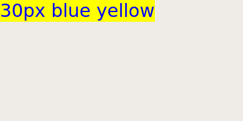

```python
#!/bin/py3
import sys
from PyQt5.QtWidgets import QApplication, QWidget, QLabel

class Gui(QWidget):
    def __init__(self):
        super().__init__()
        self.resize(400, 200)
        self.init_ui()

    def init_ui(self):
        label = QLabel('30px blue yellow', self)
        label.setStyleSheet('font-size:30px;color:blue;background-color:yellow')

if __name__ == '__main__':
    app = QApplication([])
    gui = Gui()
    gui.show()
    app.exec_()
```

#### QDialog

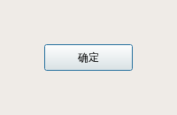

```python
#!/bin/py3
import sys
from PyQt5.QtWidgets import QApplication, QWidget, QLabel, QDialog, QPushButton

class Gui(QDialog):
    def __init__(self):
        super().__init__()
        self.init_ui()

    def init_ui(self):
        btn = QPushButton('确定',self)
        btn.setGeometry(50, 50, 100, 30)

if __name__ == '__main__':
    app = QApplication([])
    gui = Gui()
    gui.setWindowTitle('对话框')
    gui.show()
    app.exec_()
```

#### QWidget

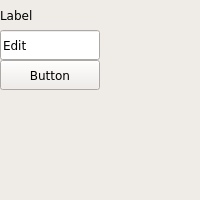

```python
#!/bin/env py3
import sys 
from PyQt5.QtWidgets import QApplication, QWidget
from PyQt5.QtWidgets import QPushButton, QMessageBox, QLabel, QLineEdit, QDesktopWidget
from PyQt5.QtGui import QIcon

if __name__ == '__main__':
    pic_path = '/auto/raid_cam/personal/zq/trash/p/pics'
    def showMsg():
        QMessageBox.information(widget, 'information', 'content')
        QMessageBox.critical(widget, 'critical', 'content')
        QMessageBox.question(widget, 'question', 'content')
        QMessageBox.warning(widget, 'warning', 'content')
        QMessageBox.about(widget, 'about', 'content')

    app = QApplication([])

    widget = QWidget()
    widget.setWindowTitle('Title')
    widget.setWindowIcon(QIcon(pic_path + '/' + 'marktext.png'))
    widget.resize(200, 300)

    window_center = QDesktopWidget().availableGeometry().center()
    x = window_center.x()
    y = window_center.y()
    x_tmp, x_tmp, width, heigh = widget.frameGeometry().getRect()
    widget.move(x - width / 2, y - heigh / 2)

    label = QLabel('Label', widget)
    label.setGeometry(0, 0, 100, 30) 

    edit = QLineEdit('Edit', widget)
    edit.setGeometry(50, 0, 100, 30) 

    btn = QPushButton('Button', widget)
    btn.setGeometry(0, 40, 100, 30) 
    btn.clicked.connect(showMsg)

    widget.show()
    app.exec_()
```

#### QGroupBox

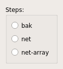

```python
#!/bin/py3
from PyQt5.QtWidgets import QApplication, QWidget, QPushButton, QRadioButton, QHBoxLayout, QVBoxLayout, QDesktopWidget, QGroupBox

class Gui(QWidget):
    def __init__(self):
        super().__init__()
        self.cen_ui()
        self.init_ui()

    def cen_ui(self):
        self.resize(100, 100)
        self.win_cen = QDesktopWidget().availableGeometry().center()
        self.cenx = self.win_cen.x()
        self.ceny = self.win_cen.y()
        self.tmp_x, self.tmp_y, self.width, self.heigh = self.frameGeometry().getRect()
        self.move(self.cenx - self.width / 2, self.ceny - self.heigh / 2)

    def init_ui(self):
        self.main_vbox_layout = QVBoxLayout()

        self.step_box = QGroupBox('Steps:')

        self.vbox_layout = QVBoxLayout()
        btn1 = QRadioButton('bak', self)
        btn2 = QRadioButton('net', self)
        btn3 = QRadioButton('net-array', self)
        self.vbox_layout.addWidget(btn1)
        self.vbox_layout.addWidget(btn2)
        self.vbox_layout.addWidget(btn3)

        self.step_box.setLayout(self.vbox_layout)
        self.main_vbox_layout.addWidget(self.step_box)

        self.setLayout(self.main_vbox_layout)

if __name__ == '__main__':
    app = QApplication([])
    widget = Gui()
    widget.show()
    app.exec_()
```

#### QMainWindow

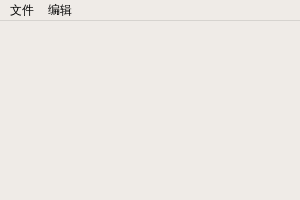

```python
#!/bin/py3
import sys
from PyQt5.QtWidgets import QApplication, QMainWindow, QLabel

class Gui(QMainWindow):
    def __init__(self):
        super().__init__()
        self.resize(300, 200)
        self.init_ui()

    def init_ui(self):
        menu = self.menuBar()
        menu_doc = menu.addMenu('文件')
        menu_doc.addAction('新建文件')
        menu_doc.addAction('打开文件')
        menu_doc.addAction('保存文件')
        menu_doc.addAction('另存文件')

        menu_edt = menu.addMenu('编辑')
        menu_edt.addAction('撤销')
        menu_edt.addAction('剪切')
        menu_edt.addAction('复制')
        menu_edt.addAction('粘贴')

if __name__ == '__main__':
    app = QApplication([])
    gui = Gui()
    gui.show()
    app.exec_()
```

### Layouts

#### HBox，VBox

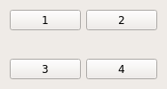

```python
#!/bin/py3
from PyQt5.QtWidgets import QApplication, QWidget, QPushButton, QHBoxLayout, QVBoxLayout, QDesktopWidget

class Gui(QWidget):
    def __init__(self):
        super().__init__()
        self.cen_ui()
        self.init_ui()

    def cen_ui(self):
        self.resize(100, 100)
        self.win_cen = QDesktopWidget().availableGeometry().center()
        self.cenx = self.win_cen.x()
        self.ceny = self.win_cen.y()
        self.tmp_x, self.tmp_y, self.width, self.heigh = self.frameGeometry().getRect()
        self.move(self.cenx - self.width / 2, self.ceny - self.heigh / 2)

    def init_ui(self):
        btn1 = QPushButton('1', self)
        btn2 = QPushButton('2', self)
        btn3 = QPushButton('3', self)
        btn4 = QPushButton('4', self)

        self.hbox1_layout = QHBoxLayout()
        self.hbox1_layout.addWidget(btn1)
        self.hbox1_layout.addStretch(1)
        self.hbox1_layout.addWidget(btn2)

        self.hbox2_layout = QHBoxLayout()
        self.hbox2_layout.addWidget(btn3)
        self.hbox2_layout.addStretch(1)
        self.hbox2_layout.addWidget(btn4)

        self.vbox_layout = QVBoxLayout()
        self.vbox_layout.addLayout(self.hbox1_layout)
        self.vbox_layout.addStretch(1)
        self.vbox_layout.addLayout(self.hbox2_layout)

        self.setLayout(self.vbox_layout)

if __name__ == '__main__':
    app = QApplication([])
    widget = Gui()
    widget.show()
    app.exec_()
```

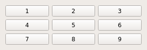

```python
#!/bin/env py3
import sys
from PyQt5.QtWidgets import QApplication, QWidget
from PyQt5.QtWidgets import QPushButton, QVBoxLayout, QHBoxLayout, QDesktopWidget

class MainWindow(QWidget):
    def __init__(self):
        super().__init__()

        self.setWindowTitle('Title')
        self.resize(300, 100)

        window_center = QDesktopWidget().availableGeometry().center()
        x = window_center.x()
        y = window_center.y()
        x_tmp, x_tmp, width, heigh = self.frameGeometry().getRect()
        self.move(x - width / 2, y - heigh / 2)

        btn1 = QPushButton('1', self)
        btn2 = QPushButton('2', self)
        btn3 = QPushButton('3', self)
        btn4 = QPushButton('4', self)
        btn5 = QPushButton('5', self)
        btn6 = QPushButton('6', self)
        btn7 = QPushButton('7', self)
        btn8 = QPushButton('8', self)
        btn9 = QPushButton('9', self)

        self.hbox_layout1 = QHBoxLayout()
        self.hbox_layout1.addWidget(btn1)
        self.hbox_layout1.addWidget(btn2)
        self.hbox_layout1.addWidget(btn3)

        self.hbox_layout2 = QHBoxLayout()
        self.hbox_layout2.addWidget(btn4)
        self.hbox_layout2.addWidget(btn5)
        self.hbox_layout2.addWidget(btn6)

        self.hbox_layout3 = QHBoxLayout()
        self.hbox_layout3.addWidget(btn7)
        self.hbox_layout3.addWidget(btn8)
        self.hbox_layout3.addWidget(btn9)

        self.vbox_layout1 = QVBoxLayout()
        self.vbox_layout1.addLayout(self.hbox_layout1)
        self.vbox_layout1.addLayout(self.hbox_layout2)
        self.vbox_layout1.addLayout(self.hbox_layout3)

        self.setLayout(self.vbox_layout1)

if __name__ == '__main__':
    app = QApplication([])
    widget = MainWindow()
    widget.show()
    app.exec_()
```

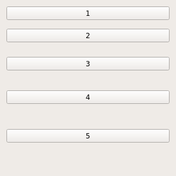

```python
#!/bin/env py3
import sys
from PyQt5.QtWidgets import QApplication, QWidget
from PyQt5.QtWidgets import QPushButton, QVBoxLayout, QHBoxLayout, QDesktopWidget

class MainWindow(QWidget):
    def __init__(self):
        super().__init__()

        self.setWindowTitle('Title')
        self.resize(300, 300)

        window_center = QDesktopWidget().availableGeometry().center()
        x = window_center.x()
        y = window_center.y()
        x_tmp, x_tmp, width, heigh = self.frameGeometry().getRect()
        self.move(x - width / 2, y - heigh / 2)

        btn1 = QPushButton('1', self)
        btn2 = QPushButton('2', self)
        btn3 = QPushButton('3', self)
        btn4 = QPushButton('4', self)
        btn5 = QPushButton('5', self)

        self.vbox_layout = QVBoxLayout()
        self.vbox_layout.addWidget(btn1)
        self.vbox_layout.addStretch(1)
        self.vbox_layout.addWidget(btn2)
        self.vbox_layout.addStretch(2)
        self.vbox_layout.addWidget(btn3)
        self.vbox_layout.addStretch(3)
        self.vbox_layout.addWidget(btn4)
        self.vbox_layout.addStretch(4)
        self.vbox_layout.addWidget(btn5)
        self.vbox_layout.addStretch(5)

        self.setLayout(self.vbox_layout)

if __name__ == '__main__':
    app = QApplication([])
    widget = MainWindow()
    widget.show()
    app.exec_()
```

#### QFormLayout

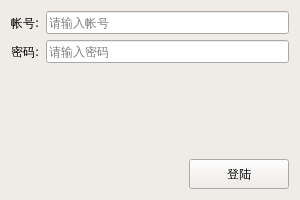

```python
#!/bin/py3
from PyQt5.QtCore import Qt
from PyQt5.QtWidgets import QApplication, QWidget, QVBoxLayout, QDesktopWidget, QFormLayout, QLineEdit, QPushButton

class Gui(QWidget):
    def __init__(self):
        super().__init__()
        self.cen_ui()
        self.init_ui()

    def cen_ui(self):
        self.resize(300, 200)
        self.win_cen = QDesktopWidget().availableGeometry().center()
        self.cenx = self.win_cen.x()
        self.ceny = self.win_cen.y()
        self.tmp_x, self.tmp_y, self.width, self.heigh = self.frameGeometry().getRect()
        self.move(self.cenx - self.width / 2, self.ceny - self.heigh / 2)

    def init_ui(self):
        vbox_layout = QVBoxLayout()
        form_layout = QFormLayout()

        user_edit = QLineEdit()
        user_edit.setPlaceholderText('请输入帐号')
        form_layout.addRow('帐号:', user_edit)

        passwd_edit = QLineEdit()
        passwd_edit.setPlaceholderText('请输入密码')
        form_layout.addRow('密码:', passwd_edit)

        login_btn = QPushButton('登陆', self)
        login_btn.setFixedSize(100, 30)

        vbox_layout.addLayout(form_layout)
        vbox_layout.addWidget(login_btn, alignment=Qt.AlignRight)

        self.setLayout(vbox_layout)

if __name__ == '__main__':
    app = QApplication([])
    widget = Gui()
    widget.show()
    app.exec_()
```

#### QStackedLayout

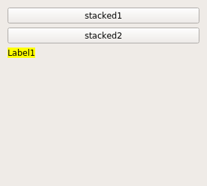

```python
#!/bin/py3
from PyQt5.QtCore import Qt
from PyQt5.QtWidgets import QApplication, QWidget, QLabel, QVBoxLayout, QHBoxLayout, QPushButton, QStackedLayout

class Window1(QWidget):
    def __init__(self):
        super().__init__()
        QLabel('Label1', self)
        self.setStyleSheet('background-color:yellow')

class Window2(QWidget):
    def __init__(self):
        super().__init__()
        QLabel('Label2', self)
        self.setStyleSheet('background-color:pink')

class Gui(QWidget):
    def __init__(self, parent=None):
        super().__init__(parent)
        self.stacked_layout = QStackedLayout()
        win1 = Window1()
        win2 = Window2()
        self.stacked_layout.addWidget(win1)
        self.stacked_layout.addWidget(win2)
        self.init_ui()

    def init_ui(self):
        self.setFixedSize(300, 270)
        vbox_layout = QVBoxLayout()

        widget = QWidget()
        widget.setLayout(self.stacked_layout)

        btn1 = QPushButton('stacked1')
        btn2 = QPushButton('stacked2')
        btn1.clicked.connect(self.btn1_clicked)
        btn2.clicked.connect(self.btn2_clicked)

        vbox_layout.addWidget(btn1)
        vbox_layout.addWidget(btn2)
        vbox_layout.addWidget(widget)
        self.setLayout(vbox_layout)

    def btn1_clicked(self):
        self.stacked_layout.setCurrentIndex(0)

    def btn2_clicked(self):
        self.stacked_layout.setCurrentIndex(1)

if __name__ == '__main__':
    app = QApplication([])
    gui = Gui()
    gui.show()
    app.exec_()
```

#### QTabWidget

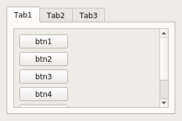

```python
#!/bin/py3
import sys
from PyQt5.QtWidgets import QApplication, QWidget, QTabWidget, QVBoxLayout, QPushButton, QScrollArea, QDesktopWidget

tabs = ['Tab1', 'Tab2', 'Tab3']
btns = ['btn1', 'btn2', 'btn3', 'btn4', 'btn5', 'btn6']

class Gui(QWidget):
    def __init__(self):
        super().__init__()
        self.cen_ui()
        self.init_ui()

    def cen_ui(self):
        self.resize(300, 200)
        self.win_cen = QDesktopWidget().availableGeometry().center()
        self.cenx = self.win_cen.x()
        self.ceny = self.win_cen.y()
        self.tmp_x, self.tmp_y, self.width, self.heigh = self.frameGeometry().getRect()
        self.move(int(self.cenx - self.width / 2), int(self.ceny - self.heigh / 2))

    def init_ui(self):
        qtab_widget = QTabWidget(self)

        for i in tabs:
            tab_widget = QWidget()
            qtab_widget.addTab(tab_widget, i)

            btn_widget = QWidget()
            btn_layout = QVBoxLayout()
            for j in btns:
                btn = QPushButton(j, btn_widget)
                btn_layout.addWidget(btn)
            btn_widget.setLayout(btn_layout)

            scroll = QScrollArea()
            scroll.setWidget(btn_widget)

            vboxlayout = QVBoxLayout(tab_widget)
            vboxlayout.addWidget(scroll)

        main_layout = QVBoxLayout(self)
        main_layout.addWidget(qtab_widget)

        self.setLayout(main_layout)

if __name__ == '__main__':
    app = QApplication([])
    widget = Gui()
    widget.show()
```

### Signals And Slots

```python

```

### Samples

## 滚动字体

```python
#!/bin/py3
import os, sys
from PyQt5.QtWidgets import QWidget, QLabel, QApplication, QVBoxLayout, QDesktopWidget, QGraphicsDropShadowEffect
from PyQt5.QtCore import Qt, QTimer
from PyQt5.QtGui import QColor, QFont

msg = 'ABC'

class BubbleWindow(QWidget):
    def __init__(self):
        super().__init__()

        self.screen_info = QDesktopWidget().screenGeometry()
        self.screen_width = self.screen_info.width()
        self.screen_height = self.screen_info.height()

        self.setWindowFlags(Qt.Tool | Qt.FramelessWindowHint | Qt.WindowStaysOnTopHint)
        self.setAttribute(Qt.WA_TranslucentBackground)
        self.setWindowOpacity(1)

        font = QFont()
        font.setBold(True)
        layout = QVBoxLayout(self)
        label = QLabel(msg)
        label.setStyleSheet('font-size:30px;color:#00ff00;')
        label.setFont(font)

        layout.addWidget(label, alignment=Qt.AlignCenter)
        self.time_counter()

    def time_counter(self):
        self.width = 0
        self.height = 0

        self.timer = QTimer(self)
        self.timer.timeout.connect(self.update_posi)
        self.timer.start(1)

    def update_posi(self):
        if self.width >= self.screen_width or self.height >= self.screen_height:
            self.width = 0
            self.height = 0

        self.move(int(self.width), int(self.height))
        self.width += 0.1

if __name__ == '__main__':
    app = QApplication(sys.argv)
    window = BubbleWindow()
    window.show()
    app.exec_()
```

### 字体淡入淡出

```python
#!/bin/py3
import os, sys
from PyQt5.QtWidgets import QWidget, QLabel, QApplication, QVBoxLayout, QDesktopWidget
from PyQt5.QtCore import Qt, QTimer
from PyQt5.QtGui import QColor, QFont

msg = 'ABC'

class BubbleWindow(QWidget):
    def __init__(self):
        super().__init__()

        self.screen_info = QDesktopWidget().screenGeometry()
        self.screen_width = self.screen_info.width()
        self.screen_height = self.screen_info.height()

        self.setWindowFlags(Qt.Tool | Qt.FramelessWindowHint | Qt.WindowStaysOnTopHint)
        self.setAttribute(Qt.WA_TranslucentBackground)
        self.packTopRight()

        font = QFont()
        font.setBold(True)
        layout = QVBoxLayout(self)
        label = QLabel(msg)
        label.setStyleSheet('font-size:20px;color:#00ff00;background-color:#101010;border-radius:20px;padding:20px')
        label.setFont(font)
        layout.addWidget(label, alignment=Qt.AlignCenter)
        self.time_counter()

    def packCenter(self):
        self.move(int(self.screen_width / 2), int(self.screen_height / 2))

    def packTopRight(self):
        self.move(int(self.screen_width), 0)

    def packTopLeft(self):
        self.move(0, 0)

    def packBottomLeft(self):
        self.move(0, int(self.screen_height))

    def packBottomRight(self):
        self.move(int(self.screen_width), int(self.screen_height))

    def time_counter(self):
        # 总时间
        self.total_time = 1.5
        self.counter_time = 0
        # 淡入淡出时间
        self.head_time = 0.5
        self.tail_time = 0.5
        self.geometry_time = 0.001
        # 不透明度
        self.opacity = 0

        self.timer = QTimer(self)
        self.timer.timeout.connect(self.update_opacity)
        self.timer.start(int(self.geometry_time * 1000))

    def update_opacity(self):
        if self.counter_time < self.total_time:
            if self.opacity < 0:
                self.opacity = 0
            elif self.opacity > 1:
                self.opacity = 1

            if self.counter_time <= self.head_time:
                self.opacity += self.geometry_time / self.head_time
                self.setWindowOpacity(self.opacity)
            elif self.counter_time >= self.total_time - self.tail_time:
                self.opacity -= self.geometry_time / self.tail_time
                self.setWindowOpacity(self.opacity)
            self.counter_time += self.geometry_time

        else:
            self.close()
            sys.exit()

if __name__ == '__main__':
    app = QApplication(sys.argv)
    window = BubbleWindow()
    window.show()
    app.exec_()
```

## socket通信

### 服务端

```python
#!/bin/py3
import sys, socket

# 创建服务器套接字
server_socket = socket.socket(socket.AF_INET, socket.SOCK_STREAM)

# 绑定套接字到主机和端口
host = '0.0.0.0'
port = 56753
server_socket.setsockopt(socket.SOL_SOCKET, socket.SO_REUSEADDR, 1)
server_socket.bind((host, port))

# 最多10个监听连接请求
server_socket.listen(10)

try:
	while True:
		sys.stdout.write(f'阻塞等待客户端的connect()\n')
		sys.stdout.flush()
		client_socket, addr = server_socket.accept()
		sfrw = client_socket.makefile('rw')
	
		while True:
			sys.stdout.write(f'阻塞等待{addr}的send()\n')
			sys.stdout.flush()

			try:
				line = sfrw.readline()
			except ConnectionResetError as e:
				sfrw.close()
				sys.stdout.write(f'客户端断开,请重新连接! {e}\n')
				sys.stdout.flush()
				break
				
			if line == '':
				sfrw.close()
				sys.stdout.write('请重新连接!\n')
				sys.stdout.flush()
				break

			if line == '@%#%@CLOSEDOWN\n':
				exit(0)
			
			sfrw.write(line)
			sfrw.flush()
			sys.stdout.write(line)
			sys.stdout.flush()
				
		sfrw.close()
		client_socket.close()
except KeyboardInterrupt as e:
	sys.stdout.write(f'手动退出! {e}\n')
	sys.stdout.flush()

# 关闭连接
finally:
	server_socket.close()
```

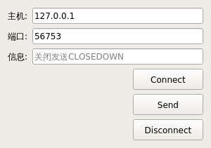

### 客户端

```python
#!/bin/py3
import sys, socket, time
from functools import partial
from PyQt5.QtCore import Qt
from PyQt5.QtWidgets import QApplication, QWidget, QVBoxLayout, QDesktopWidget, QLineEdit, QPushButton, QFormLayout

prefix = '@%#%@'
class Gui(QWidget):
	def __init__(self):
		super().__init__()
		self.setWindowTitle('socket通信')
		self.pack_center()
		self.init_ui()

	def pack_center(self):
		self.resize(300, 200)
		self.screen_center = QDesktopWidget().availableGeometry().center()
		self.screen_center_x = self.screen_center.x()
		self.screen_center_y = self.screen_center.y()
		self.xPos = int(self.screen_center.x() - self.frameGeometry().getRect()[2] / 2)
		self.yPos = int(self.screen_center.y() - self.frameGeometry().getRect()[3] / 2)
		self.move(self.xPos, self.yPos)

	def connect(self, hostLineEdit, portLineEdit):
		try:
			self.client_socket = socket.socket(socket.AF_INET, socket.SOCK_STREAM)
			self.host = hostLineEdit.text()
			self.port = int(portLineEdit.text())
			self.client_socket.connect((self.host, self.port))
		except:
			print("异常")

	def send(self, msgLineEdit):
		try:
			message = msgLineEdit.text()
			self.client_socket.send((prefix + message + '\n').encode('utf-8'))
		except:
			print("异常")

	def disconnet(self):
		try:
			self.client_socket.close()
		except:
			print("异常")

	def init_ui(self):
		formLayout = QFormLayout()
		vboxLayout = QVBoxLayout()

		hostLineEdit = QLineEdit()
		hostLineEdit.setText('127.0.0.1')
		formLayout.addRow('主机:', hostLineEdit)

		portLineEdit = QLineEdit()
		portLineEdit.setText('56753')
		formLayout.addRow('端口:', portLineEdit)

		msgLineEdit = QLineEdit()
		msgLineEdit.setPlaceholderText('关闭发送CLOSEDOWN')
		formLayout.addRow('信息:', msgLineEdit)

		connectBtn = QPushButton('Connect', self)
		connectBtn.setFixedSize(100, 30)
		connectBtn.clicked.connect(partial(self.connect, hostLineEdit, portLineEdit))

		sendBtn = QPushButton('Send', self)
		sendBtn.setFixedSize(100, 30)
		sendBtn.clicked.connect(partial(self.send, msgLineEdit))

		disconnectBtn = QPushButton('Disconnect', self)
		disconnectBtn.setFixedSize(100, 30)
		disconnectBtn.clicked.connect(self.disconnet)

		vboxLayout.addLayout(formLayout)
		vboxLayout.addWidget(connectBtn, alignment=Qt.AlignRight)
		vboxLayout.addWidget(sendBtn, alignment=Qt.AlignRight)
		vboxLayout.addWidget(disconnectBtn, alignment=Qt.AlignRight)

		self.setLayout(vboxLayout)

if __name__ == '__main__':
	app = QApplication([])
	widget = Gui()
	widget.show()
	app.exec_()
```
