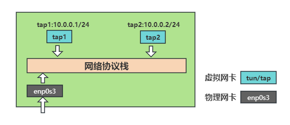
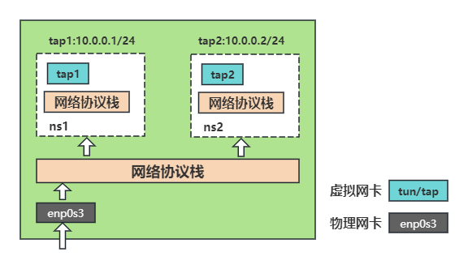
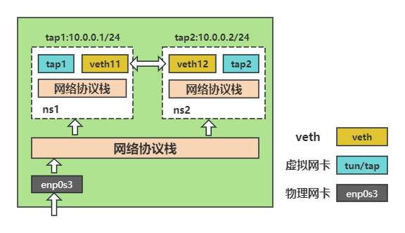
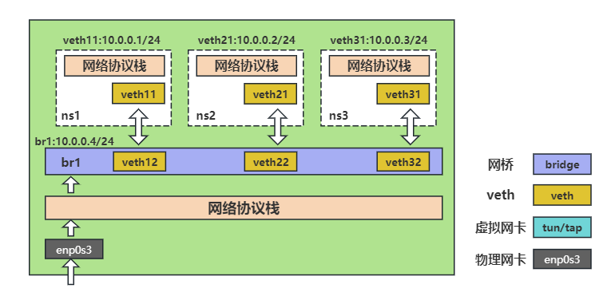
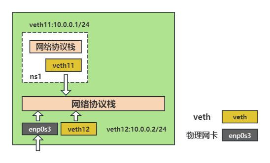
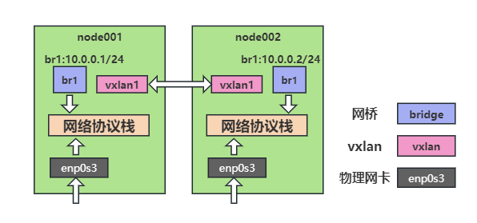

# abstract

[TOC]

# configures

## environment (Java)

```shell
# 新增etc/profile.d/customer.csh
mkdir -p /usr/lib/jvm
tar xvf ./jdk-9.0.4_linux-x64_bin.tar.gz -C /usr/lib/jvm
export JAVA_HOME=/usr/lib/jvm/jdk-9.0.4
export JRE_HOME=$JAVA_HOME/jre
export PATH=$PATH:$JAVA_HOME/bin
export CLASSPATH=$JAVA_HOME/lib:$JAVA_HOME/jre/lib
```

## update source

[阿里云镜像链接](https://mirrors.aliyun.com)
[网易镜像链接](https://mirrors.163.com)

- 配置文件

```shell
vim /etc/yum.conf
# 备份
mkdir -p /etc/yum.repos.d/backup
mv /etc/yum.repos.d/*repo /etc/yum.repos.d/backup/
curl -o /etc/yum.repos.d/CentOS-Base.repo https://mirrors.aliyun.com/repo/Centos-7.repo
curl -O /etc/yum.repos.d/epel.repo http://mirrors.aliyun.com/repo/epel-7.repo
yum clean all
yum makecache
```

* 本地源

```shell
# 挂载镜像到/mnt
mount image.iso /mnt
# 加入以下内容
tee -a /etc/yum.repo.d/local.repo <<- 'EOF'
[base]
name=CentOS7-Local
baseurl=file:///mnt/
enabled=1
gpgcheck=0
EOF
```

## sleep

```bash
vim /etc/systemd/logind.conf
# 按下电源键锁屏
HandlePowerKey=lock
# 合上笔记本盖锁屏
HandleLidSwitch=lock
# 生效
systemctl restart systemd-logind
```

## limits

```bash
# 非root用户最大进程数
vim /etc/security/limits.d/20-nproc.conf
# soft lock 120s
echo 120 > /proc/sys/kernel/watchdog_thresh
```

## firewall

```bash
# 修改selinux
vim /etc/sysconfig/selinux
SELINUX=disabled
systemctl stop firewalld
systemctl disabled firewalld
# 查看
getenforce
setenforce 0
```

## vim

```bash
vim /etc/vimrc
set ff=unix
set ts=4
# scrolloff
set so=5
# cursorline
set cul
set nocul
set cuc
set nocuc
set nu
set nonu
set lazyredraw
set expandtab
```
## samba
### samba服务端
```shell
# 配置文件/etc/samba/smb.conf

[global]
    workgroup = SAMBA
    security = user
    # 匿名用户无密码登陆
    map to guest = Bad User

    passdb backend = tdbsam

    printing = cups
    printcap name = cups
    load printers = yes
    cups options = raw

[homes]
    comment = Home Directories
    valid users = %S, %D%w%S
    browseable = No
    read only = No
    inherit acls = Yes

[printers]
    comment = All Printers
    path = /var/tmp
    printable = Yes
    create mask = 0600
    browseable = No

[print$]
    comment = Printer Drivers
    path = /var/lib/samba/drivers
    write list = @printadmin root
    force group = @printadmin
    create mask = 0664
    directory mask = 0775

# 共享名
[share]
    # 描述
    comment = share
    # 共享路径
    path = /share
    # 是否可用smbclient -L发现 用ip连接不显示共享文件夹
    browseable = yes
    # 可读写
    writeable = yes
    # 匿名用户访问默认yes 与public一致 排最后的生效
    guest ok = yes
    public = no
    # 允许哪些用户组登陆
    # valid users = fool,@group
    # 不允许哪些用户组登陆
    # invalid users = fool1,@group1
```
#### nfs 客户端
### linux 客户端
```bash
# 查看共享清单
smbclient -L 192.168.1.2
# linux客户端终端挂载
monut //192.168.1.2:/share /mnt
# linux客户端文件浏览器挂载
smb://10.136.67.26/opt/
# 取消挂载
umount /mnt
```
### windows 客户端
```bash
# cmd输入
\\192.168.1.2\share
```

## nfs
### nfs 服务端
```shell
# 关闭防火墙
systemctl stop firewalld
# 查看端口nfs 2049
cat /etc/services | grep nfs
# 修改配置文件
cat /etc/exports
/nfs *(rw,insecure,async,no_root_squash,no_all_squash)
# 创建共享目录
mkdir /nfs
chmod 777 /nfs
systemctl restart nfs
systemctl enable nfs
# 查看NFS端口号
netstat -anput | grep 2049
```
### nfs 客户端
#### linux
```bash
# 查看共享挂载
showmount -e 192.168.1.2
# linux客户端挂载
monut 192.168.1.2:/nfs /mnt
umount /mnt
```
#### windows
```bash
cd C:\Windows\system32
# 查看共享挂载
showmount -e 192.168.1.2
# windows客户端挂载
\\192.168.1.2\nfs
```

## ssh

* ssh免密码

```shell
ssh-keygen -t rsa
ssh-copy-id local_ip
ssh-copy-id remote_ip
```

* ssh 端口转发

-f 后台
-N 不打开ssh远程
-g 启用网关功能 不止本机可以用

ssh -L

10.136.1.4: 本地主机 ssh client
10.136.1.5: 远程主机 ssh server
10.136.1.6: 要访问的主机

```shell
# 10.136.1.6上禁止10.136.1.4访问
iptables -A INPUT -s 10.136.1.4
# 10.136.1.4与10.136.1.6通过10.136.1.5建立隧道
ssh -fNL 8888:10.136.1.6:23 10.136.1.5
# 10.136.1.4访问本机8888端口通过10.136.1.5的ssh加密 解密转发到h003
telnet 127.0.0.1 8888
```

ssh -R

10.136.1.4: 远程主机 ssh server
10.136.1.5: 本地主机 ssh client
10.136.1.6: 要访问的主机

```shell
# 10.136.1.4上开启网关功能
vim /etc/ssh/sshd_config
GatewayPorts yes
systemctl restart sshd
# 10.136.1.5上
ssh -fNR 8888:10.136.1.6:23 10.136.1.4
# 10.136.1.4上
telnet 127.0.0.1 8888
```

ssh -D

10.136.1.4: 本地主机 ssh client
10.136.1.5: 远程主机 ssh server

```shell
# 10.136.1.4上
ssh -D 8888 root@10.136.1.5 -fNg
# 其他主机通过10.136.1.4代理访问网络
curl --socks5 10.136.1.4:8888 https://www.baidu.com
```

ssh -X

本机打开远程的图形界面
10.136.1.4: 本地主机 ssh client
10.136.1.5: 远程主机 ssh server

```shell
# 10.136.1.4上
ssh -X 10.136.1.5
xclock
```

* ssh 隧道

ssh -w

10.136.1.4: 本地主机 ssh client
10.136.1.5: 远程主机 ssh server

```shell
# 修改远程主机ssh服务配置/etc/ssh/sshd_config
PermitTunnel yes
# 重启sshd
systemctl restart sshd
# 在本机
ssh -w 0:0 root@10.136.1.5 -fN
# 在本机
ip addr add 10.0.0.1/24 dev tun0
ip link set tun0 up
# 在远程
ip addr add 10.0.0.2/24 dev tun0
ip link set tun0 up
```

## privoxy

```shell
# 安装privoxy
yum install privoxy -y
# 修改配置文件
vim /etc/privoxy/config
# 修改以下
listen-address  0.0.0.0:8118              # http代理(局域网代理)
forward-socks5  / 10.136.59.60:8888 .     # socks代理转http代理
forward-socks4a / 10.136.59.60:8888 .
forward-socks5t / 10.136.59.60:8888 .
forward 10.*.*.*/  .
forward 127.*.*.*/ .
forward localhost/ .
# 启动privoxy服务
systemctl start privoxy
# 查看开启端口
ss -ntl | grep ':8118'
```

## nc

| args | 作用        |
| ---- | --------- |
| -l   | 监听模式      |
| -p   | 指定端口      |
| -s   | 指定源ip     |
| -w   | 指定超时时间    |
| -u   | 指定UDP协议   |
| -v   | 详细信息      |
| -z   | 只扫描 不发送信息 |

```shell
# 10.136.1.4客户端监听8888端口
nc -l -p 8888
# 服务端发送
nc 10.136.1.4 8888
# 端口转发
nc -l -p 5901 -c 10.136.1.4 8888
```

## tcpdump

```shell
# 抓enp0s3网口的包
tcpdump -ni enp0s3
# 抓enp0s3网口的icmp包
tcpdump -ni enp0s3 icmp
# 抓enp0s3网口的发往10.136.59.73的包
tcpdump -ni enp0s3 host 10.136.59.73
```

## ss

| args | 作用            |
|:----:|:-------------:|
| -s   | 连接统计信息        |
| -l   | listen状态      |
| -u   | udp协议端口       |
| -t   | tcp协议端口       |
| -a   | 显示所有端口连接      |
| -n   | 显示端口号,不显示服务名称 |
| -o   | options       |

```bash
# 源端口或目的端口22
ss -o dport = :22 or sport = :22
# 源ip 10.136.59.73或ip 127.0.0.1
ss src 10.136.59.73 or dst 127.0.0.1
```

## iptables

* 四表五链

| tables\chains | INPUT          | OUTPUT         | FORWARD        | PREROUTING     | POSTROUTING    |
| ------------- |:--------------:|:--------------:|:--------------:|:--------------:|:--------------:|
| filter        | <mark>V</mark> | <mark>V</mark> | <mark>V</mark> | X              | X              |
| nat           | X              | <mark>V</mark> | X              | <mark>V</mark> | <mark>V</mark> |
| mangle        | <mark>V</mark> | <mark>V</mark> | <mark>V</mark> | <mark>V</mark> | <mark>V</mark> |
| raw           | X              | <mark>V</mark> | X              | <mark>V</mark> | X              |

| args    | 作用                         |
|:-------:|:-------------------------- |
| -t      | 指定表(默认filter)              |
| -p      | 协议                         |
| -s      | 源ip/网段                     |
| --sport | 源端口                        |
| -d      | 目标ip/网段                    |
| --dport | 目标端口                       |
| -i      | 进网络接口                      |
| -o      | 出网络接口                      |
| -A      | 底部插入                       |
| -I      | 顶部插入                       |
| -D      | 删除                         |
| -F      | 清空指定表(默认filter)指定链(默认所有)规则 |
| -X      | 删除链                        |
| -Z      | 链计数器清零                     |
| -j      | 指定目标(action或链)             |

| actions    | 作用  |
|:----------:|:--- |
| DROP       | 丢弃  |
| REJECT     | 拒绝  |
| ACCEPT     | 接受  |
| REDIRECT   | 转发  |
| MASQUERADE | 伪装  |
| LOG        | 日志  |

```bash
# 安装iptables-services
yum install iptables-services
# 查看软件相关配置文件
rpm -ql iptables-services.x86_64

# 查看iptables规则
iptables -nL --line-number
# 设置filter默认规则 Chain INPUT (policy DROP)
iptables -t filter -P INPUT DROP

# 禁IP/网段
iptables -t filter -A INPUT -s 10.136.67.29 -j REJECT
iptables -t filter -A INPUT -s 10.136.67.0/24 -j REJECT
# 禁10.136.67.29访问自己的80端口
iptables -t filter -A INPUT -s 10.136.67.29 -p tcp --dport 80 -j REJECT
# 开头添加
iptables -t filter -A INPUT -s 10.136.67.29 -j REJECT
# 删除
iptables -D INPUT 1
# 清空
iptables -F
# 开启端口转发(临时)
echo 1 > /proc/sys/net/ipv4/ip_forward
# 或
sysctl -w net.ipv4.ip_forward = 1
# 开启端口转发(永久)
echo "net.ipv4.ip_forward = 1" >> /etc/sysctl.conf
sysctl -p
# 访问本机器8888端口将转发到5901端口上
iptables -t nat -A PREROUTING -p tcp --dport 8888 -j REDIRECT --to-port 5901
```

不同ip之间端口转发(iptables实现)
```shell
# 只能远程访问 不能本地访问
iptables -t nat -A PREROUTING -p tcp --dport 5000 -j DNAT --to-destination 192.168.1.5:22
iptables -t nat -A POSTROUTING -j MASQUERADE
# 能远程访问和本地访问
echo 1 > /proc/sys/net/ipv4/conf/all/route_localnet
iptables -t nat -A OUTPUT -p tcp --dport 5000 -j DNAT --to-destination 192.168.1.5:22
```

ns1: veth11:10.0.0.1/24
ns2: veth12:10.0.0.2/24 veth21:11.0.0.2/24
ns3: veth22:11.0.0.1
```shell
# 新建3个Network NameSpace
ip netns add ns1
ip netns add ns2
ip netns add ns3
# 创建两对veth
ip link add veth11 type veth peer name veth12
ip link add veth21 type veth peer name veth22
# veth添加到ns
ip link set veth11 netns ns1
ip link set veth12 netns ns2
ip link set veth21 netns ns2
ip link set veth22 netns ns3
# 配ip
ip netns exec ns1 ip addr add 10.0.0.1/24 dev veth11
ip netns exec ns2 ip addr add 10.0.0.2/24 dev veth12
ip netns exec ns2 ip addr add 11.0.0.2/24 dev veth21
ip netns exec ns3 ip addr add 11.0.0.1/24 dev veth22
# 开启
ip netns exec ns1 ip link set lo up
ip netns exec ns2 ip link set lo up
ip netns exec ns3 ip link set lo up
ip netns exec ns1 ip link set veth11 up
ip netns exec ns2 ip link set veth12 up
ip netns exec ns2 ip link set veth21 up
ip netns exec ns3 ip link set veth22 up
# 此时同网段才互通,不同网段不通
# 10.0.0.1 -> 11.0.0.2 不通
# 10.0.0.1上配路由
ip netns exec ns1 ip route add 11.0.0.0/24 via 10.0.0.2 dev veth11
# 10.0.0.1 -> 11.0.0.2 通
# 10.0.0.1 -> 11.0.0.1 不通
ip netns exec ns1 ping 11.0.0.1
ip netns exec ns3 tcpdump -ni 10.0.0.1
# 可发现11.0.0.1收到了10.0.0.1的包只是没路由返回
# ns3配路由
ip netns exec ns3 ip route add 10.0.0.0/24 via 11.0.0.2 dev veth22
ip netns exec ns1 ping 11.0.0.1
# 此时都通了

# 实现隐藏原ip
# ns2
iptables -t nat -A POSTROUTING -j MASQUERADE
# 或ns2使用这个
ip netns exec ns1 iptables -t nat -A POSTROUTING -s 10.0.0.0/24 -j SNAT --to 10.0.0.2
ip netns exec ns1 iptables -t nat -A POSTROUTING -s 11.0.0.0/24 -j SNAT --to 11.0.0.2
# 确认
ip netns exec ns1 ping 11.0.0.1
ip netns exec ns3 tcpdump -i veth22
# 此时来源11.0.0.2 看不出包来源于10.0.0.1
```


配置192.168.0.4与192.168.1.5互通
node001: enp0s3:192.168.0.4/24
node002: enp0s3:192.168.0.5/24 enp0s8:192.168.1.4/24
node003: enp1s3:192.168.1.5/24

step1:node001上配静态路由

```shell
route add -net 192.168.1.0/24 gw 192.168.0.5
# 192.168.0.4 ping 192.164.1.4 ok
# 192.168.0.4 ping 192.164.1.5 ng
```

step2:node002上开启路由转发

```shell
# 启用转发
# 方法1
# node002上
echo 1 > /proc/sys/net/ipv4/ip_forward
iptables -t nat -A POSTROUTING -j MASQUERADE
iptables -t nat -A POSTROUTING -s 192.168.0.0/24 -j SNAT --to 192.168.1.4
tcpdump -i enp0s3 # node003上运行 数据包来自192.168.0.4
# 方法2
# node002上(配置静态路由或网关)
echo 1 > /proc/sys/net/ipv4/ip_forward
route add -net 192.168.0.0/24 gw 192.168.1.4 # node003上配置
tcpdump -i enp0s3 # node003上运行 来自192.168.1.4
# 192.168.0.4 ping 192.164.1.5 # ok
```

配置端口映射
node001: enp0s3:192.168.0.4/24
node002: enp0s3:192.168.0.5/24 enp0s8:192.168.1.4/24
node003: enp1s3:192.168.1.5/24
访问192.168.0.5:22将转发到192.168.1.5:22

step1:

```shell
# node002上
echo 1 > /proc/sys/net/ipv4/ip_forward
iptables -t nat -A PREROUTING -d 192.168.0.5 -j DNAT --to-destination 192.168.1.5
iptables -t nat -A PREROUTING -d 192.168.0.5 -p tcp --dport 22 -j DNAT --to-destination 192.168.1.5:22
ssh 10.136.0.5
# ssh 10.136.0.5后主机为node003
```

## ip

说明: 主机ip 10.136.59.73

* tuntap



```shell
# 添加两个tap网卡设备
ip tuntap add dev tap1 mode tap
ip tuntap add dev tap2 mode tap
# 查看tuntap网卡设备
ip tuntap show
# ip tuntap list
# 配置ip
ip addr add 10.0.0.1/24 dev tap1
ip addr add 10.0.0.2/24 dev tap2
# 删除ip
# ip addr del 10.0.0.1/24 dev tap1
# ip addr del 10.0.0.2/24 dev tap2
# 启动两个tap网卡设备
ip link set tap1 up
ip link set tap2 up
# 关闭两个tuntap网卡设备
# ip link set tap1 down
# ip link set tap2 down
# 主机能通虚拟网卡(没有ns隔离)
```

* netns



```shell
# 新建两个Network NameSpace
ip netns add ns1
ip netns add ns2
# 进入ns1 ns2 (开两个终端)
# ip netns exec ns1 csh
# ip netns exec ns2 csh
# 将两个网络设备添加进去
ip link set tap1 netns ns1
ip link set tap2 netns ns2
# 配置ip
ip netns exec ns1 ip addr add 10.0.0.1/24 dev tap1
ip netns exec ns2 ip addr add 10.0.0.2/24 dev tap2
# 启动两个tuntap网卡设备(配置lo才能通自己)
ip netns exec ns1 ip link set lo up
ip netns exec ns2 ip link set lo up
ip netns exec ns1 ip link set tap1 up
ip netns exec ns2 ip link set tap2 up
# 查看ip
ip netns exec ns1 ip addr
ip netns exec ns2 ip addr
# 此时虚拟网卡不能通主机
ip netns exec ns1 ping 10.136.67.73
ip netns exec ns2 ping 10.136.67.73
```

* veth



```shell
# 新建一对veth
ip link add veth11 type veth peer name veth12
# 添加到ns中
ip link set veth11 netns ns1
ip link set veth12 netns ns2
# 启动veth
ip netns exec ns1 ip link set veth11 up
ip netns exec ns2 ip link set veth12 up
# 配置路由
ip netns exec ns1 ip route change 10.0.0.0/24 via 0.0.0.0 dev veth11
ip netns exec ns2 ip route change 10.0.0.0/24 via 0.0.0.0 dev veth12
# 此时tap1与tap2互通
ip netns exec ns1 ping 10.0.0.2
ip netns exec ns2 ping 10.0.0.1
```

* brctl

常用命令

```shell
# 安装
yum install -y bridge-utils
# 显示网桥
brctl show
# 新建网桥
ip link add br1 type bridge
# brctl addbr br1
# 添加设备(tap1)到网桥(br1)
ip link set tap1 master br1
# brctl addif br1 tap1
```

配置三个ns互连



```shell
# 新建ns
ip netns add ns1
ip netns add ns2
ip netns add ns3
# 新建veth pair
ip link add veth11 type veth peer name veth12
ip link add veth21 type veth peer name veth22
ip link add veth31 type veth peer name veth32
# veth到ns
ip link set veth11 netns ns1
ip link set veth21 netns ns2
ip link set veth31 netns ns3
# 配ns的ip与开启
ip netns exec ns1 ip addr add 10.0.0.1/24 dev veth11
ip netns exec ns2 ip addr add 10.0.0.2/24 dev veth21
ip netns exec ns3 ip addr add 10.0.0.3/24 dev veth31
ip netns exec ns1 ip link set lo up
ip netns exec ns2 ip link set lo up
ip netns exec ns3 ip link set lo up
ip netns exec ns1 ip link set veth11 up
ip netns exec ns2 ip link set veth21 up
ip netns exec ns3 ip link set veth31 up
# 新建开启网桥br1
ip link add br1 type bridge
ip link set br1 up
# 添加veth到br1
ip link set veth12 master br1
ip link set veth22 master br1
ip link set veth32 master br1
# 开启veth
ip link set veth12 up
ip link set veth22 up
ip link set veth32 up
# ns间可互通
# 主机不能通ns，需要添加ip给br1
ip addr add 10.0.0.4/24 dev br1
# ns不能通主机，配路由
ip netns exec ns1 ip route add default via 10.0.0.4 dev veth11
ip netns exec ns2 ip route add default via 10.0.0.4 dev veth21
ip netns exec ns3 ip route add default via 10.0.0.4 dev veth31
# ns不能通主机网段其他主机，需开启转发，配iptables
echo 1 > /proc/sys/net/ipv4/ip_forward
iptables -t nat -A POSTROUTING -s 10.0.0.0/24 -j MASQUERADE
# 或使用这个
iptables -t nat -A POSTROUTING -s 10.0.0.0/24 -j SNAT --to 10.136.59.73
```

如需访问外网

```shell
# veth配ip 添加路由

ip netns exec ns1 ip route add default via 0.0.0.0 dev veth11
ip netns exec ns2 ip route add default via 0.0.0.0 dev veth21
ip netns exec ns3 ip route add default via 0.0.0.0 dev veth31
```

配置使用netns网络与主机互通



```shell
# 主机ip 10.136.59.73
# 新建ns1
ip netns add ns1
# 新建一对veth pair
ip link add veth11 type veth peer name veth12
# veth11加入ns1
ip link set veth11 netns ns1
# 配ip与开启
ip netns exec ns1 ip addr add 10.0.0.1/24 dev veth11
ip netns exec ns1 ip link set veth11 up
ip netns exec ns1 ip link set lo up
ip addr add 10.0.0.2/24 dev veth12
ip link set veth12 up
# 主机可通10.0.0.1 走veth对
ping 10.0.0.1
# 10.0.0.1不可通10.136.59.73(未配置路由)
ip netns exec ns1 ping 10.136.59.73
# 配置路由可通
ip netns exec ns1 ip route add default via 10.0.0.2 dev veth11
# 但是不通主机所在网段其他主机/网关
ip netns exec ns1 ping 10.136.59.254
# veth11能收到包 enp0s3不能
tcpdump -ni veth11 icmp
tcpdump -ni enp0s3 icmp
# 启用转发把veth11转发到enp0s3
echo 1 > /proc/sys/net/ipv4/ip_forward
# enp0s3能收到包
tcpdump -ni enp0s3 icmp
# 但是无reply(网关收到了包 但是不知道10.0.0.1的出接口/网关没有配置10.0.0.1的路由)
# 将所有为10.0.0.0/24网段的原ip的转成10.136.59.73
iptables -t nat -A POSTROUTING -s 10.0.0.0/24 -j MASQUERADE
# 或使用这个
iptables -t nat -A POSTROUTING -s 10.0.0.0/24 -j SNAT --to 10.136.59.73
# enp0s3有reply了
tcpdump -ni enp0s3 icmp
```

* vxlan



主机1:192.168.0.1(node001)
主机2:192.168.0.2(node002)

```shell
# 主机1
ip link add br1 type bridge
ip addr add 10.0.0.1/24 dev br1
ip link set br1 up
# 主机2
ip link add br2 type bridge
ip addr add 10.0.0.2/24 dev br2
ip link set br2 up
# 主机1 vxlan
ip link add vxlan1 type vxlan id 1 remote 192.168.0.2 desport 8888 dev enp0s3
ip link set vxlan1 up
# 主机2 vxlan
ip link add vxlan2 type vxlan id 2 remote 192.168.0.1 desport 8888 dev enp0s3
ip link set vxlan2 up
# 10.0.0.1与10.0.0.2互通
```

## route

静态路由添加与删除
ip/网段 192.168.2.0
掩码    255.255.255.0
网关    10.0.0.254

```shell
# windows
route add -p 192.168.2.0 mask 255.255.255.0 10.0.0.254
route delete -p 192.168.2.0 mask 255.255.255.0 10.0.0.254
# linux
route add -net 192.168.2.0/24 gw 10.0.0.254 dev enp0s3
route del -net 192.168.2.0/24 gw 10.0.0.254 dev enp0s3
ip route 192.168.2.0/24 via 10.0.0.254 dev enp0s3
```

## docker

### 网站

[官方网站](https://www.docker.com)
[官方镜像仓库网站](https://hub.docker.com)

### 安装

```shell
# 卸载原始docker
yum remove docker*
# 安装docker
yum-config-manager --add-repo https://download.docker.com/linux/centos/docker-ce.repo
yum install docker-ce
# yum禁用subscription-manager插件
vim /etc/yum/pluginconf.d/subscription-manager.conf
```

### 添加源

```shell
sudo mkdir -p /etc/docker
sudo tee /etc/docker/daemon.json <<- 'EOF'
{
    "registry-mirrors": [
        "https://hub-mirror.c.163.com",
        "https://docker.mirrors.ustc.edu.cn",
        "https://docker.m.daocloud.io",
        "https://docker.1panel.live",
        "https://registry.docker-cn.com"
    ],
    "dns": [
        "8.8.8.8",
        "8.8.4.4"
    ]
}
EOF

systemctl daemon-reload
systemctl restart docker
```

### 代理
```shell
mkdir -p /etc/systemd/system/docker.service.d
sudo tee /etc/systemd/system/docker.service.d/http-proxy.conf <<- 'EOF'
[Service]
Environment="HTTPS_PROXY=https://127.0.0.1:7890"
Environment="HTTP_PROXY=http://127.0.0.1:7890"
Environment="NO_PROXY=localhost,127.0.0.1,::1"
EOF

systemctl daemon-reload
systemctl restart docker
```

### 常用命令

```shell

# 查看docker信息
docker version
docker info
docker system df

# 安装镜像
docker search redis
docker pull redis

# 查看本地镜像
docker images

# 启动容器
docker run -it redis -p 8080:80 -name redis1 /bin/bash
# 查看运行的容器
docker ps
# 查看所有容器
docker ps -a
# 查看容器log
docker logs 容器id
# attach到容器
docker exec -it 容器id /bin/bash
docker attach 容器id

# 删除镜像
docker rmi redis

# 删除所有镜像
docker rmi -f $(docker images -qa)

# 清理
docker system prune

# 清理未使用的docker网络
docker network prune

# 清理未使用的docker容器
docker container prune

# 清理未使用的volume
docker volume prune

# 打包容器
docker export 容器id > package.tar
# 打包镜像
docker save -o package.tar REPOSITORY:TAG

# 导入包为本地镜像
docker load -i package.tar

# 根据image id 定义REPOSITORY和TAG
docker tag 镜像id REPOSITORY:TAG
```

# install/unistall

## unistall no use apps

```shell
# unistall smart card
chkconfig pcscd off
/etc/init.d/pcscd stop
yum remove esc
# 关闭提醒PackageKit Update Applet
gnome-session-properties
```

## chrome

```shell
# 添加源google-chrome
vim /etc/yum.repos.d/google-chrome.repo
# 添加以下内容
[google-chrome]
name=google-chrome
baseurl=http://dl.google.com/linux/chrome/rpm/stable/$basearch
enabled=1
gpgcheck=1
gpgkey=https://dl-ssl.google.com/linux/linux_signing_key.pub
# 安装chrome浏览器
yum -y install google-chrome-stable --nogpgcheck
# 启动chrome浏览器
/opt/google/chrome/chrome --no-sandbox
```

## kchmviewer

```bash
# 添加源
curl 'https://copr.fedorainfracloud.org/coprs/scx/kchmviewer/repo/epel-7/scx-kchmviewer-epel-7.repo' > '/etc/yum.repos.d/scx-kchmviewer-epel-7.repo'
# 安装kchmviewer阅读器
yum -y install kchmviewer
```

## FileSystems

### ntfs

```shell
# ntfs-3g
yum install -y ntfs-3g
```

### davfs2

```shell
# 源码安装neno
./configure --prefix=/usr/local/ --with-ssl && make && make install
# 源码安装davfs2
./configure --prefix=/usr/local/ --with-ssl && make && make install
# 创建用户，组
groupadd -g 1100 davfs2
useradd davfs2 -u 1100 -g 1100 -d /home/davfs2 -s /sbin/nologin
# 修改配置文件davfs2.conf
vim /etc/davfs2/davfs2.conf
use_locks 0
ignore_dav_header 1
# 添加帐号密码到secrets
vim /etc/davfs2/secrets
https://app.koofr.net/dav zq488***891@outlook.com ii***********pn
https://dav.jianguoyun.com/dav 488***891@qq.com ax************8f
# 挂载
mkdir -p /dav/JianGuoYun
mkdir -p /dav/koofr
sudo mount.davfs https://dav.jianguoyun.com/dav /dav/JianGuoYun
sudo mount.davfs https://app.koofr.net/dav /dav/koofr
```

## tigervnc

```shell
# 安装tigervnc
yum install tigervnc -y
yum install tigervnc-server -y
# 设置密码
vncpasswd
# 开机启动：
cp /lib/systemd/system/vncserver@.service /lib/systemd/system/vncserver@:1.service
修改vncserver@:1.service 用户名
systemctl daemon-reload
systemctl restart vncserver@\:1.service
systemctl enable vncserver@\:1.service
# 开启/关闭VNC窗口
vncserver :1 -depth 24 -geometry 1920x1080
vncserver -kill :1
# 共享VNC窗口(无密码)
x0vncserver -display=':0.0' -rfbport=5900 -securitytypes none &
export DISPLAY=":0.0"
x0vncserver -PasswordFile=/root/.vnc/passwd -AlwaysShared=on -AcceptPointerEvents=on -AcceptKeyEvents=on -geometry=1366x768
# 连接VNC
vncviewer 192.168.1.100:5900
# 修改分辨率
cvt 1280 960
xrandr
xrandr --newmode "1280x960_60.00" 101.25 1280 1360 1488 1696 960 963 967 996 -hsync +vsync
xrandr --addmode Virtual1 "1280x960_60.00"
xrandr --output Virtual1 --mode 1280x960
```

## glibc

```shell
# 下载glic源码
curl -O http://ftp.gnu.org/gnu/glibc/glibc-2.18.tar.gz
# 解压
tar xvf glibc-2.18.tar.gz -C ./
# 编译安装
cd glibc-2.18/
mkdir build
cd build/
../configure --prefix=/usr
make -j4
make install
```

## freetds

```shell
# 解压
tar xvf freetds-0.91.tar.gz -C ./
# 编译安装到/usr/local/freetds下
cd freetds-0.91
./configure --prefix=/usr/local/freetds --with-tdsver=7.0 --enable-msdblib
make && make install
```

## rclone

```shell
# 解压
unzip /opt/rclone-v1.65.0-linux-amd64.zip
# 安装手册页
mkdir -p /usr/local/share/man/man1
mandb
cp /opt/rclone-v1.65.0-linux-amd64/rclone /usr/bin/
# 安装fuse3
yum install fuse3
# 获取token(onedrive)
rclone authorize "onedrive"
# linux配置onedrive
rclone config
chmod a+x rcloned
cp rcloned /etc/init.d/onedrive_rcloned
# 开机启动
chkconfig onedrive_rcloned on
# 挂载
systemctl start onedrive_rcloned
```

# system

## network modules

```shell
# 查看网卡驱动
ethtool -i enp0s3
# 查看模块信息
modinfo r8169
# 查看模块信息
/sbin/modinfo /lib/modules/2.6.32-642.el6.x86_64/kernel/drivers/net/e1000e/e1000e.ko
# 卸载e1000e模块
/sbin/rmmod e1000e
# 安装模块
tar xvf modified_r8168-8.052.01.tar.gz
cd r8168-8.052.01/src
make && make modules
# 卸载r8169网卡模块
modprobe -r r8169
# 加载r8168
modprobe r8168
# 开机卸载r8169网卡模块
echo 'blacklist r8169' > /etc/modprobe.d/rmmod_r8169.conf
# 开机加载r8168网卡模块
echo 'r8168' > /etc/modules-load.d/modprobe_r8168.conf
# 重新生成img
dracut --force
```

## linux-5.7.12
```bash
# 编译linux-5.7.12
sudo tar xvf linux-5.7.12.tar.xz
sudo tar xvf busybox-1.33.0.tar.bz2
sudo yum install ncurses-devel.x86_64
sudo yum install elfutils-libelf-devel
export ARCH=arm
export CROSS_COMPILE=/opt/5.4.0/bin/arm-linux-
cd /opt/linux-5.7.12
sudo make clean
# sudo make ARCH=arm vexpress_ca9x4_defconfig
sudo make vexpress_defconfig
sudo make menuconfig
# System Type Enable the L2x0 outer cache controller []
sudo make zImage -j6
make modules
make dtbs
make -j4
```
## make filesystem

```shell
# 制作文件系统
yum install glibc-static.x86_64
cd /opt/busybox-1.33.0
修改makefile
ARCH=arm
CROSS_COMPILE=/opt/5.4.0/bin/arm-linux-
make clean
make menuconfig
Build static binary (no shared libs) [*]
make -j4
make install
mkdir -p rootfs/{lib,dev}
cp -r _install/* rootfs/
cp -r /opt/5.4.0/lib/* rootfs/lib/
mknod -m 666 rootfs/dev/tty1 c 4 1
mknod -m 666 rootfs/dev/tty2 c 4 2
mknod -m 666 rootfs/dev/tty3 c 4 3
mknod -m 666 rootfs/dev/tty4 c 4 4
mknod -m 666 rootfs/dev/console c 5 1
mknod -m 666 rootfs/dev/null c 1 3
dd if=/dev/zero of=./a9rootfs.ext3 bs=1M count=32
mkdir tmpfs
mkfs.ext3 a9rootfs.ext3
mount -t ext3 ./a9rootfs.ext3 tmpfs/ -o loop
cp -r rootfs/* tmpfs/
du -sh tmpfs/
umount tmpfs
du -sh tmpfs/
qemu-system-arm -M vexpress-a9 -m 512M -kernel /opt/linux-5.7.12/arch/arm/boot/zImage -dtb /opt/linux-5.7.12/arch/arm/boot/dts/vexpress-v2p-ca9.dtb -nographic -append "root=/dev/mmcblk0 rw console=ttyAMA0" -sd /opt/busybox-1.33.0/a9rootfs.ext3
```

# commands

## control table

```shell
# Example of job definition:
# .---------------- minute (0 - 59)
# |  .------------- hour (0 - 23)
# |  |  .---------- day of month (1 - 31)
# |  |  |  .------- month (1 - 12) OR jan,feb,mar,apr ...
# |  |  |  |  .---- day of week (0 - 6) (Sunday=0 or 7) OR sun,mon,tue,wed,thu,fri,sat
# |  |  |  |  |
# *  *  *  *  * user-name  command to be executed

# 查看定时任务
crontab -l
10 10 * * * /usr/sbin/ntpdate 10.136.65.64 ; /sbin/clock -w
01 07 * * * rsync -avz /raid_cam/CAM_BACKUP/ /Database_cam6/CAM_BACKUP/
```
## runlevels

```shell
# shutdown
init 0
# command
init 3
# graph = startx
init 5
# reboot
init 6
```

## kdialog
```shell
# 界面
notify-send -t 2000 "备份信息" "备份完成！"
zenity --info --text "备份完成!"
kdialog --title "备份信息" --msgbox "备份完成!"
kdialog --title "备份信息" --error "备份错误！"
```

## find
```shell
# 删除搜索到的文件
find ./ -name "*filename*" | xargs rm -rf
bash && rm -rf !(1|2|3)
```

## network configure
```shell
# 静态ip
rout -n
vim /etc/sysconfig/network-scripts/ifcfg-ChinaNet-431
BOOTPROTO=static
IPADDR="192.168.1.99"
NETMASK="255.255.255.0"
GATEWAY="192.168.1.1"
sudo systemctl restart NetworkManager
```

## disk usage
```shell
lsblk
```

## nmap tool
```shell
sudo yum install dsniff
sudo yum install nmap
nmap -O 192.168.1.1-30
echo 1 > /proc/sys/net/ipv4/ip_forward
sudo arpspoof -i wlp1s0 -t 192.168.1.2 -r 192.168.1.1
```

## linux gedit
```shell
rpm -ivh gconf-editor-2.28.0-3.el6.x86_64.rpm
```

```shell
# 数字转字母
echo $num | awk '{if($1>=0&&$1<=9){$1=$1+48}else if($1>=10&&$1<=35){$1=$1+87}else{$1=0} printf"%c\n",$1}'
# 字母转数字
echo $letter | tr '[A-Z]' '[a-z]' | xargs -i printf "%d-87\n" "'{}" | bc

# 料号打包
cd /auto/incam_db_tmp/jobs
tar zcvf ~/Desktop/06tgeo619aeka.tar.gz 06tgeo619aeka/

# 发送邮件
/usr/bin/sendEmail -f "FROM XXXXX<XXXXXXX@xx.xxxxxxxx.com>" -t "bigxxxqun@163.com" -s "xx.xx.xx.xx:25" -u "SUBJECT" -o message-content-type=html -o message-charset=utf8 -xu "xxxxxxxx@xx.xxxxxxxxx.com" -xp "Aaxxxx56" -m "邮件内容" -a ./file.txt

# MSSQL查询
echo "select SPEC_VALUE from xxx where xxx = 'xxx'\ngo" | /usr/local/freetds/bin/tsql -H xx.xx.xx.xx -p1433 -U xxx -P xxxxxxxx | sed -n '8,$p' |sed 's/[12]> //g' |sed '$d'

# soft lock设置120秒
echo "120" > /proc/sys/kernel/watchdog_thresh

# 清除内存
sync；echo "1" > /proc/sys/vm/drop_caches

# 生成文件500M
time dd of=./speed.test if=/dev/zero bs=1024 count=`echo "1024 * 500" | bc`

# 播放
set card_device = `aplay -L | grep "CARD" | sed -n '1p'`
aplay -D $card_device ./noise.wav

# 内存文件系统
# 手动挂载
mount -t tmpfs -o size=2G tmpfs /tmp
# 开机挂载
echo 'tmpfs /tmp tmpfs defaults,size=2G 0 0' >> /etc/fstab
```

# redirect

| args     | 作用                         |
| -------- | -------------------------- |
| 0        | 标准输入描述符                    |
| 1        | 标准输出描述符                    |
| 2        | 标准错误描述符                    |
| >  或 1>  | 标准输出                       |
| >> 或 1>> | 标准追加输出                     |
| 2>       | 标准错误                       |
| 2>>      | 标准追加错误                     |
| &>       | 标准输出与标准错误合并在一起             |
| >&       | 标准输出与标准错误合并在一起 后面不能跟大与2的数字 |
| 1>&2     | 标准输出转标准错误                  |
| 2>&1     | 标准错误转标准输出                  |

```bash
echo "Hello" > /tmp/file1
rm /tmp/file2
# 丢弃标准错误
cat /tmp/file1 /tmp/file2 2>/dev/null
# 丢弃标准输出
cat /tmp/file1 /tmp/file2 >/dev/null
# 分两条输出到log
cat /tmp/file1 /tmp/file2 2>./err_log >./out_log
# 丢弃标准错误,标准输出
cat /tmp/file1 /tmp/file2 &>/dev/null
cat /tmp/file1 /tmp/file2 >/dev/null 2>&1
# 输出标准错误,丢弃标准输出
cat /tmp/file1 /tmp/file2 2>&1 >/dev/null
```
